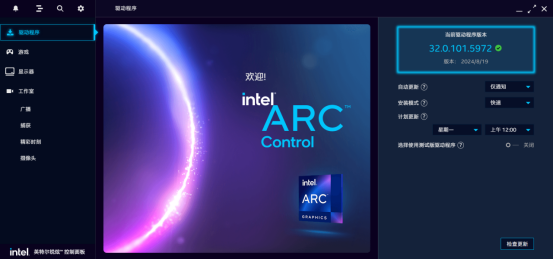
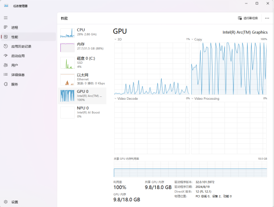

# PyTorch drives Intel XPU model training
author:[Hmm466](https://github.com/Hmm466/)

## Overview

In previous practice, when we trained the Yolo model of ultralytics, the available computing devices were usually limited to CPU, MPS and CUDA. However, since the release of PyTorch2.5, the situation has changed. PyTorch2.5 officially supports Intel discrete graphics cards, which means that we can use Intel discrete graphics cards to train models.
Specifically, PyTorch2.5 can provide support on different operating systems and corresponding Intel graphics card series. Under Linux system, it supports Intel® Data Center GPU Max series; under Windows system, it supports Intel® Arc™ series. If you want to try to use Intel graphics cards in different ways, you can refer to the website https://dgpu-docs.intel.com/driver/client/overview.html to install the GPU driver.
Next, this article will use the Windows platform of Intel® Core™ Ultra 7 155H to carry out specific demonstrations and applications, so that everyone can more intuitively understand the relevant operation process and actual effects.

## Driver Installation

### Linux
If you are using the Linux operating system and want to take full advantage of the performance of Intel discrete graphics, it is crucial to install the correct GPU driver. In this process, you can refer to the URL https://dgpu-docs.intel.com/driver/client/overview.html, which provides detailed and comprehensive guidance to help you successfully complete the GPU driver installation.

### Windows
When using Intel graphics cards, if you purchase a genuine system and use the default Windows system, the system will usually install the Intel ® Sharp ™ Control Panel by default. This control panel provides users with convenient graphics settings and management functions, allowing users to personalize the graphics card according to their needs.

However, if you find that the Intel ® Sharp ™ Control Panel is not installed in your system, don't worry, you can go to the Intel official support website to download it. Intel provides users with a wealth of support resources, including detailed solutions for graphics card-related issues and download links for various practical tools. You can visit the website https://www.intel.com/content/www/us/en/support/products/80939/graphics.htm, where you can find various information related to Intel graphics product support, covering many Intel processor series, graphics products, and related technologies and solutions. By browsing this page, you can get more comprehensive product support information, which will help you gain a deeper understanding of the features and functions of Intel graphics products. In addition, for how to install the Intel® Graphics Driver in Windows 10 and Windows 11, you can refer to the URL https://www.intel.com/content/www/us/en/support/articles/000005629/graphics/processor-graphics.html. This page details two installation methods. The recommended method is to use the Intel® Driver & Support Assistant to automatically detect and install the driver. You only need to download the assistant, which will intelligently identify the driver required for your system and complete the installation process. For more information, please refer to the Intel® Driver & Support Assistant FAQ.


### PyTorch Installation
Installing Pytorch is relatively simple. First, create a virtual Python environment and then.

```shell
$pip install --pre torch torchvision torchaudio --index-url https://download.pytorch.org/whl/nightly/xpu
```
Note: Please be sure to add --index-url https://download.pytorch.org/whl/nightly/xpu. If you do not add it, the non-XPU version may be installed.

Verify:
```python
import torch
```
If the prompt "******xpu.dll not found" appears, first check whether the installation is complete, review whether there are any omissions, errors or interruptions, and confirm whether the dependent components are installed in place. At the same time, check whether the network has been hijacked. You can change the network environment or use a detection tool to check.

If there is a problem, download and install it again. Before that, delete the pip cache, clean up old files and error records, ensure that subsequent downloads are complete and correct, complete the installation smoothly, and restore the normal operation of the program.

```shell
$pip uninstall torch 
$pip uninstall torchaudio
$pip uninstall torchvision 
$pip install --pre torch torchvision torchaudio --index-url https://download.pytorch.org/whl/nightly/xpu
```
Confirm whether xpu can be used:
```python
torch.xpu.is_available()
True
```

## Using XPU for model training
Previously, when training models on Intel hosts, the process could be started by executing the corresponding code. However, due to the lack of CUDA, the training process was time-consuming and only relied on CPU computing. For example, in my experience, it took six hours to complete a round of training using the CPU, which was extremely inefficient.

Fortunately, the situation has changed a lot now. The same training task has been greatly reduced in time and can now be completed in just one and a half hours, with significant improvement in efficiency.

```python
model = YOLO("yolo11s.pt")  # load a pretrained model (recommended for training)
# Train the model
results = model.train(data="yolo.yaml", epochs=100, imgsz=640)
```
According to the official documentation, when using relevant tools to carry out training, if you want to enable devices other than the default device, the operation process is very convenient. You only need to accurately pass the corresponding device parameter in the train method to easily switch devices, adapt to diverse hardware resources, and optimize training performance.

However, as far as the current situation is concerned, the official framework of ultralytics has not yet provided native support for XPU, which undoubtedly sets an obstacle for us to use the powerful computing power of XPU to accelerate the training process. If we insist on enabling XPU in the training process, we have to conduct in-depth analysis and targeted modification of the source code. This process not only tests technical skills, but also comes with many potential risks such as code stability and compatibility.

Fortunately, even though we are limited by the lack of official support for XPU, we still have workarounds. We can bypass the complex source code changes and instead set up the training equipment reasonably at the outer layer to cleverly guide the training tasks to adapt to the expected hardware equipment, so as to ensure that the training work can be carried out efficiently and smoothly in an environment that meets its own hardware conditions and computing power requirements.

```python
if __name__ == '__main__':
    freeze_support()
    # Load a model
    model = YOLO("yolo11s.pt")  # load a pretrained model (recommended for training) and transfer weights
    device_str = "xpu:0"
    device = torch.device(device_str)
    model = model.to(device)
    # Train the model
    results = model.train(data="switch.yaml", epochs=100, imgsz=640)
```


## Summarize
This article focuses on the core theme of improving deep learning model training efficiency and optimizing hardware resource utilization, focusing on the Intel® Arc™ series platform, and deeply explains the transformation process from the traditional CPU training mode to the XPU-enabled training mode, especially using Yolo model training as a typical example for analysis.

In the past, when Yolo model training relied on CPU, the training cycle was long and the hardware resource utilization rate was low due to the CPU single-core processing power and serial operation mechanism, which greatly restricted the speed of model iteration optimization. With the advent of XPU technology on the Intel® Arc™ series platform, the situation has been completely reversed. The article details how to use this advanced platform to smoothly migrate the cornerstone of training computing power from CPU to XPU, and fully unleash the collaborative advantages of multiple processing units and efficient parallel computing performance of XPU. In this transformation process, the training time has been greatly compressed, the originally long training time has been sharply reduced, and the efficiency has increased several times or even dozens of times, turning model training from a time-consuming "long-distance race" into an efficient "sprint".

More importantly, this XPU-based training innovation will not only benefit the Yolo model. In the long run, with XPU's excellent architectural design and strong computing power support, many subsequent models and cutting-edge technologies built on the torch framework can be seamlessly connected and deeply utilize its powerful capabilities. Whether it is complex image recognition, semantic segmentation, or deep neural network models in the field of natural language processing, XPU will become a "powerful catalyst" for them to accelerate iteration and break through performance bottlenecks, truly achieving all-round acceleration of deep learning technology and driving the entire field towards a more efficient and intelligent direction.